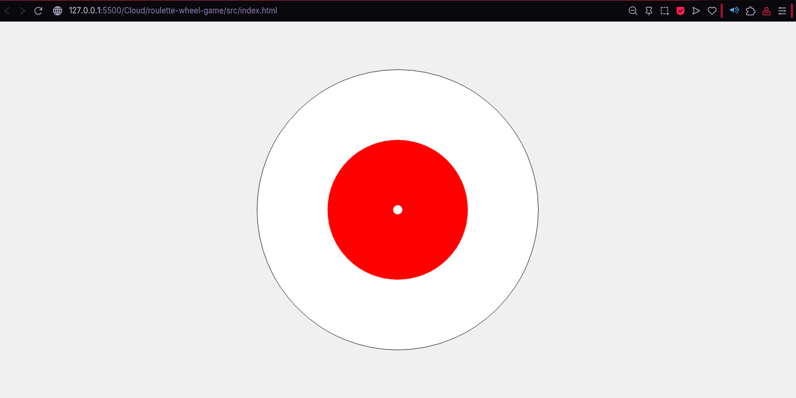
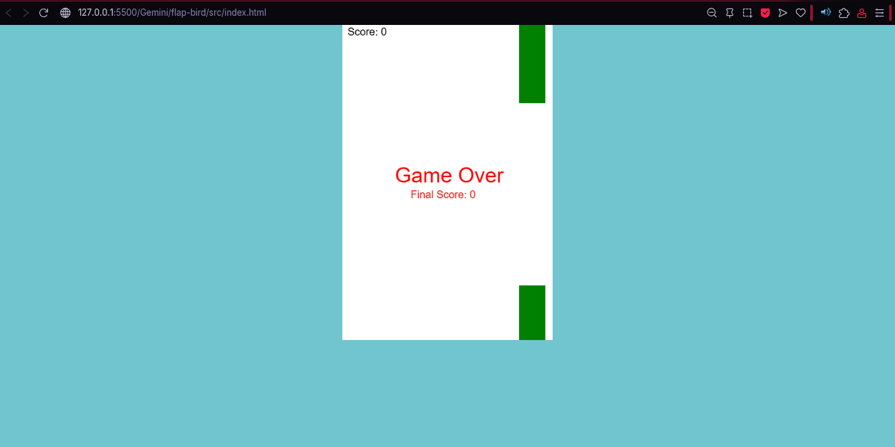
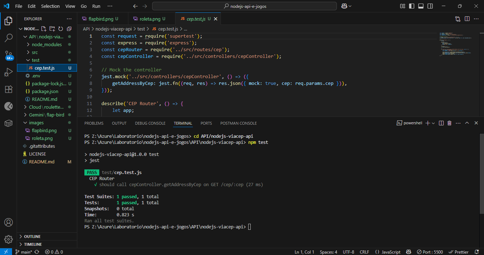

# Nodejs API e Jogos

Bem-vindo ao repositório **Azure Roleta Jogos**! Este projeto reúne experimentos e aplicações desenvolvidas durante meus estudos em Node.js, integração com APIs externas (como ViaCEP), e desenvolvimento de jogos web simples, como o Flap Bird.

---

## Como entregar esse projeto?

1. **Crie um novo repositório no GitHub** com um nome de sua preferência.
2. **Adicione este arquivo README.md** na raiz do projeto.
3. **Inclua prints de tela** das principais funcionalidades (veja exemplos abaixo).
4. **Descreva o processo de desenvolvimento, aprendizados e possibilidades**.

---

## Prints do Projeto

> 
> 
> 

---

## Descrição do Processo

Durante o desenvolvimento deste projeto, busquei integrar diferentes tecnologias e conceitos:

- **Node.js e Express:** Para criar uma API RESTful simples e eficiente.
- **Integração com ViaCEP:** Consumo de API externa para busca de endereços a partir do CEP, retornando dados em JSON.
- **Testes Automatizados:** Utilização de Jest e Supertest para garantir a qualidade e funcionamento das rotas da API.
- **Desenvolvimento Front-end:** Criação de um jogo simples (Flap Bird) utilizando HTML5 Canvas, CSS e JavaScript puro.

---

## Insights e Possibilidades

- **Integração de APIs:** Aprendi como consumir APIs externas de forma segura e eficiente usando Axios.
- **Testes Automatizados:** Compreendi a importância dos testes para garantir a estabilidade do código, especialmente em APIs.
- **Organização de Projeto:** Estruturei o projeto separando controllers, services e rotas, facilitando a manutenção e escalabilidade.
- **Desenvolvimento Full Stack:** Experimentei unir back-end (Node.js) e front-end (jogos web) em um mesmo repositório, mostrando versatilidade.

---

## Aprendizados

- Como estruturar um projeto Node.js do zero.
- Como criar e consumir rotas RESTful.
- Como utilizar Jest e Supertest para testes automatizados.
- Como consumir APIs públicas (ViaCEP) e tratar erros de forma adequada.
- Como criar jogos simples com HTML5 Canvas.

---

## Possibilidades Futuras

- Adicionar autenticação e autorização na API.
- Expandir o jogo Flap Bird com novos recursos e desafios.
- Integrar banco de dados para armazenar resultados de jogos ou consultas de CEP.
- Publicar a API em um serviço cloud (Azure, Heroku, etc).

---

## Como rodar o projeto

1. Instale as dependências:
   ```
   npm install
   ```
2. Inicie a API:
   ```
   npm start
   ```
3. Rode os testes:
   ```
   npm test
   ```
4. Abra o arquivo `index.html` do Flap Bird em seu navegador para jogar.

---

## Contato

Fique à vontade para abrir issues ou pull requests, ou entrar em contato para dúvidas e sugestões!